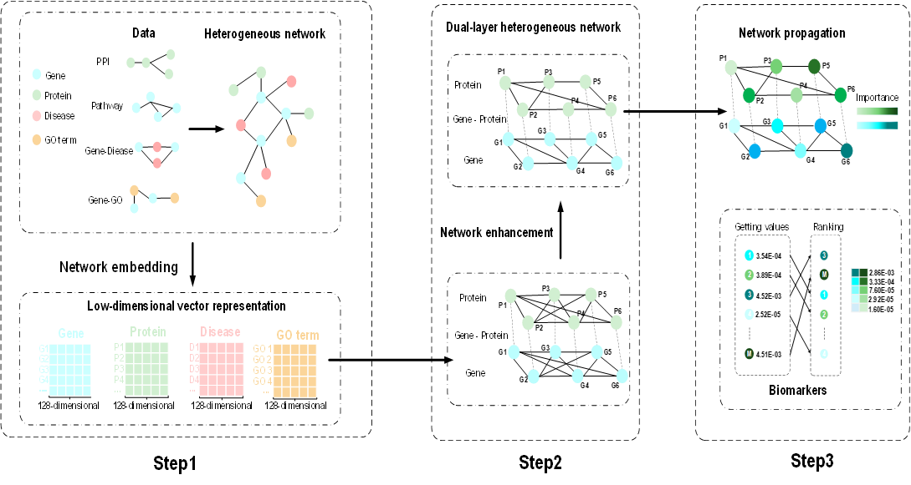

# DualMarker

DualMarker: A multi-source fusion identification method for prognostic biomarkers of breast cancer based on dual-layer heterogeneous network.

## Description



## Getting Started

### Introduction

DualMarker is a biomarker recognition algorithm.

### Special dependencies

* **MATLAB** R2020a or later (R2021b+ recommended)
* **Statistics and Machine Learning Toolbox** (for standardization & classifier; you can also use `TreeBagger`)
* **Parallel Computing Toolbox** *(optional)* for faster repeated CV

> The repository includes implementations of `classRF_train/classRF_predict` and `AUC`. If you prefer MATLAB’s native classifier, replace them with `TreeBagger/predict` (an example is provided below).

---

### Overview

The repository is organized as follows:

* `DualMarkerMainCode.m`

  Main pipeline of  **DualMarker** :

  1. Build the heterogeneous network and compute RandNE embeddings;
  2. Derive prior scores from DisGeNET (gene–disease) and expression (t-test), normalize and fuse;
  3. Perform random walk / network propagation on the **dual-layer** network;
  4. Output final **biomarker ranking** in variable `geneRANK`.
* `KFoldCrossValidation.m`

  **Repeated 5-fold cross-validation** (default  **50 repeats × 5 folds** ) on **Top-50/100/150** features selected from `geneRANK`. Trains a classifier (random forest by default) and reports AUC for each repeat as well as the final mean AUCs.
* Core utilities

  `A_RWRplus.m`, `Network_Enhancement.m`, `getNormalizedMatrix_Heter.m`,

  `getRandNEemb_in.m` / `RandNE_*`, `Obtain_StatisticScore.m`, `TransitionFields.m`, `GS.m`, …
* `Data/`

  **One packaged `.mat` file** with everything needed to run DualMarker and the CV script (see below).

---

### Data

We provide a single packaged file (example name):

```
Data/DualMarker_demo.mat
```

#### This `.mat` contains all required variables:

* **Heterogeneous network adjacency**

  `AdjGfG, AdjGfP, AdjGfD, AdjGfGO, AdjPfP, AdjPfD, AdjDfD, AdjDfGO, AdjGOfGO`
* **Expression matrix & gene list**

  `GSE2034`, `Genelist`
* **DisGeNET prior**

  `breastGenediease`

> If you use your own data, simply load a `.mat` that defines the variables above with the same names.

---

### Running DualMarker

#### 1) Produce the biomarker ranking

```matlab
addpath(genpath(pwd));                % add repo to MATLAB path
load('Data/DualMarker_demo.mat');     % load the packaged inputs

run('DualMarkerMainCode.m');          % produces variable "geneRANK"
head(geneRANK);                       % [gene, score] sorted descending
```

#### 2) 5-fold CV (50 repeats) at Top-50/100/150

```matlab
% Requires "geneRANK" from the step above
run('KFoldCrossValidation.m');
```

The script prints each repeat’s 5-fold mean AUC and the final means, e.g.:

```
[Repeat 50/50] AUC@50=0.8421 | AUC@100=0.8615 | AUC@150=0.8576

Final Mean AUC Values:
Top-50:  0.8384
Top-100: 0.8570
Top-150: 0.8531
```

**(Optional) Save the AUC lists**

```matlab
writematrix(GSE2034_aucScore_list_50,  'GSE2034_top50_auc.csv');
writematrix(GSE2034_aucScore_list_100, 'GSE2034_top100_auc.csv');
writematrix(GSE2034_aucScore_list_150, 'GSE2034_top150_auc.csv');
```

---

### Evaluating DualMarker

* **Top-K feature selection** is handled inside `KFoldCrossValidation.m` via `geneRANK(1:K)`.
* **Classifier** : by default we use a random forest (`classRF_*`). To use MATLAB’s native model:

```matlab
  % Example replacement using TreeBagger
  model = TreeBagger(500, train_X', categorical(train_Y));
  [~, score] = predict(model, test_X');
  score_pos = score(:,2);
  auc = AUC(test_Y, score_pos');
```

* **Standardization** : the script applies `zscore` + `mapstd`, consistent with the paper; feel free to swap in your preferred preprocessing.

---

### Quick test

```matlab
addpath(genpath(pwd));
load('Data/DualMarker_demo.mat');

run('DualMarkerMainCode.m');      % produces geneRANK
run('KFoldCrossValidation.m');    % prints AUC results
```

---
